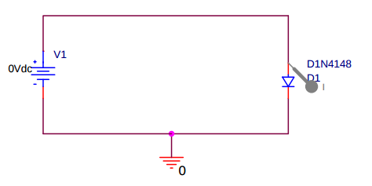
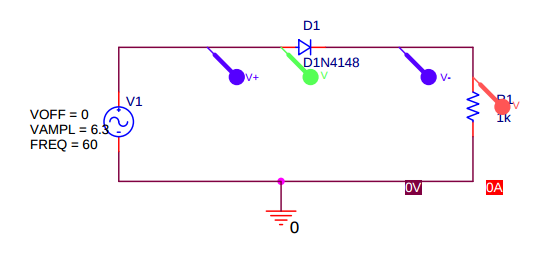
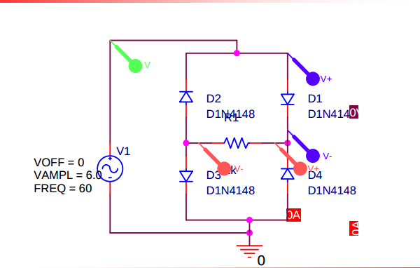

# Ewha Womans' Basic Circuit Laboratory II (36095-02)

## Led by : [Professor Park, Sung Min](https://www.researchgate.net/profile/Sung_Park15)

Taken by : Benjamin Haos

## Week Two (Friday March 11th 2016)

# Diodes & Rectifiers

A diode is a specialized electronic component with two electrodes called the anode and the cathode. Most diodes are made with semiconductor materials such as silicon, germanium, or selenium.[*](https://www.google.com/search?sourceid=chrome-psyapi2&ion=1&espv=2&ie=UTF-8&q=diode&oq=Diod&aqs=chrome.1.69i57j0l5.2622j0j7)

### Basic Diagram:

* A diode allows electricity to flow in one direction but not the other. *(ideally)*
* When the applied in the blocked dirrection the diode will experience [avalanche breakdown](https://en.wikipedia.org/wiki/Avalanche_breakdown).

This is a basic example of a diode used in a circuit :

A simulation with a square wave applied, shown in green, and current flow, shown in yellow, can be viewed [here](http://lushprojects.com/circuitjs/circuitjs.html?cct=$+1+0.000005+10.200277308269968+50+5+50%0Aw+336+112+576+112+0%0Aw+336+272+576+272+0%0Ag+576+272+576+384+0%0Av+336+112+336+272+0+2+40+5+0+0+0.5%0Ad+576+112+576+272+1+0.805904783%0Ao+4+64+0+551+5+1.130782121458166e+73+0+-1%0A).

(If you right click on the diode, you can view the scope waveform)

Another way to understand the diode can be found by examining [this simulation](http://lushprojects.com/circuitjs/circuitjs.html?cct=$+1+0.000005+13.097415321081858+55+5+50%0Av+240+352+240+128+0+1+40+5+0+0+0.5%0Ar+544+128+544+352+0+640%0Ad+240+128+544+128+1+0.805904783%0Aw+240+352+544+352+0%0Ao+0+64+0+35+5+0.0125+0+-1%0Ao+1+64+0+35+5+0.0125+1+-1%0A).

A common use of a diode can be understood by examining a "Half-Wave Rectifier" circuit. The basic circuit looks like this :

[Example Half-Wave Rectifier circuit](http://lushprojects.com/circuitjs/circuitjs.html?cct=$+1+0.000005+13.097415321081858+55+5+50%0Av+240+352+240+128+0+1+40+5+0+0+0.5%0Ar+544+128+544+352+0+640%0Ad+240+128+544+128+1+0.805904783%0Aw+240+352+544+352+0%0Ao+0+64+0+35+5+0.0125+0+-1%0Ao+1+64+0+35+5+0.0125+1+-1%0A)

Even more interesting, the full wave rectifier circuit, created with four diodes hooked in opposing pairs and wired in parallel, takes alternating current and returns with only positive current flow.

A basic schematic looks like this :

And here is a scoped example of the 
[Full-Wave Rectifier](http://lushprojects.com/circuitjs/circuitjs.html?cct=$+1+0.000005+10.200277308269968+53+5+50%0Av+240+384+240+96+0+1+40+5+0+0+0.5%0Aw+240+96+384+96+0%0Aw+384+96+384+160+0%0Ad+384+160+448+224+1+0.805904783%0Ad+384+288+448+224+1+0.805904783%0Ad+320+224+384+160+1+0.805904783%0Ad+320+224+384+288+1+0.805904783%0Aw+384+288+384+384+0%0Aw+384+384+240+384+0%0Aw+320+224+320+320+0%0Aw+448+224+496+224+0%0Aw+320+320+496+320+0%0Ar+496+224+496+320+0+100%0Ax+543+280+580+283+0+20+load%0Ao+0+64+0+35+10+0.05+0+-1%0Ao+12+64+0+35+5+0.05+1+-1%0A)

## Conclusion.

Diodes are basic but useful electronic parts.

